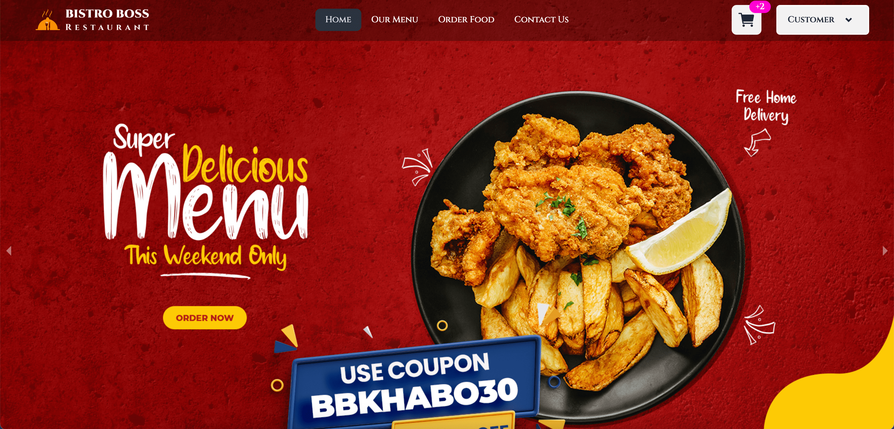

# Bistro Boss Restaurant

Welcome to **Bistro Boss Restaurant**, a comprehensive restaurant web application offering seamless online reservations, menu browsing, order management, and a dynamic dashboard system for users and admins.

---

## Features

### **User Features**

1. **Authentication**  
   - Email and password registration.  
   - Google registration for easy sign-up/sign-in.  
   - CAPTCHA integration for enhanced login security.  
   - Firebase Authentication for secure and reliable user authentication.  

2. **User Dashboard**  
   - **Order Management**: Users can place and manage orders.  
   - **Payment Integration**: Secure payments via Stripe.  
   - **Reservations**: Book tables directly from the dashboard.  
   - **Food Reviews**: View other user's reviews on the food cart before ordering.  
   - **Messaging**: Send messages to the admin/owner for queries or feedback.  
   - **Order History**: View all bookings and orders.  
   - **Add Reviews**: Provide feedback for a food item.  

---

### **Admin Features**

1. **Admin Dashboard**  
   - **Revenue Tracking**: View total revenue generated.  
   - **User Management**: See the count of all registered users and manage user roles (add/remove admins).  
   - **Menu Management**:  
     - Add new menu items.  
     - Update existing items.  
     - Delete items.  
   - **Order Management**:  
     - View all orders.  
     - Update order statuses for user visibility (e.g., Accepted, Cooking, Packaging, Picked by Rider, Delivered).  
   - **Booking Management**:  
     - Confirm, cancel, or delete table reservations.  
   - **Messaging System**: Manage messages sent by users.  

---

## Tech Stack

- **Frontend**:  
  - React.js  
  - Tailwind CSS  
  - React Router  
  - Axios  
  - Various third-party libraries (React Icons, SweetAlert2, Swiper, etc.)  

- **Backend**:  
  - Node.js  
  - Express.js  
  - MongoDB  
  - Stripe for payment processing  
  - JSON Web Tokens (JWT) for authentication  
  - Firebase Authentication for managing user authentication  

- **Deployment**:  
  - Frontend : Vercel
  - Backend : Railway

---

## Live Site

Explore the live application here: [Bistro Boss Restaurant](https://bistro-boss-client-lemon.vercel.app/)

---
